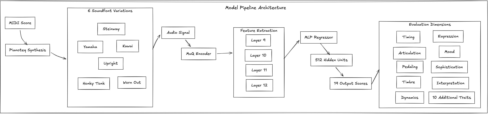
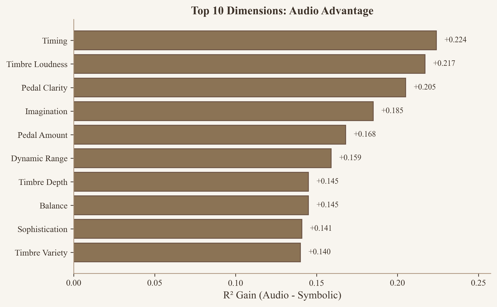

# CrescendAI

Audio-based piano performance evaluation using music foundation models.

## Key Result

**R² = 0.537** on PercePiano benchmark (55% improvement over symbolic baselines)



## Architecture

| Component | Details |
|-----------|---------|
| Foundation Model | MuQ-large (~300M params, frozen) |
| Embedding | Layers 9-12 averaged, 1024-dim |
| Pooling | mean + std -> 2048-dim |
| Prediction Head | MLP: 2048 -> 512 -> 512 -> 19 (~1M trainable params) |
| Ensemble | 4-fold cross-validation |

## Training Data

- **PercePiano**: 1,005 piano performances with 19-dimensional human annotations
- **Audio**: 24kHz, synthesized from MIDI using Salamander/Pianoteq soundfonts
- **Validation**: 4-fold piece-stratified cross-validation

## Metrics

| Model | R² | 95% CI | MAE |
|-------|-----|--------|-----|
| MuQ L9-12 (ours) | 0.537 | [0.465, 0.575] | 0.067 |
| Symbolic baseline | 0.347 | [0.315, 0.375] | 0.095 |



## 19 Performance Dimensions

**Technical**: timing | **Articulation**: length, touch | **Pedaling**: amount, clarity
**Timbre**: variety, depth, brightness, loudness | **Dynamics**: range
**Musical**: tempo, space, balance, drama | **Mood**: valence, energy, imagination
**Interpretation**: sophistication, overall

## Web Platform

Serverless Rust/Leptos app on Cloudflare Workers with RAG-powered feedback.

### RAG Pipeline

- **Retrieval**: BM25 (D1 FTS5) + dense vectors (BGE-base, Vectorize)
- **Fusion**: Reciprocal Rank Fusion (K=60)
- **Reranking**: BGE-reranker-base cross-encoder
- **Generation**: Llama 3.3 70B with cited sources

### API

```
POST /api/analyze          Upload and analyze audio
GET  /api/performances/:id Get analysis results
```

## Project Structure

```
model/           PyTorch Lightning training pipeline
apps/web/        Leptos/Rust web application (Cloudflare Workers)
apps/inference/  HuggingFace inference endpoint
```

## Setup

### Training Pipeline

```bash
cd model
uv sync
uv run python -m audio_experiments.training.runner
```

### Web Application

```bash
cd apps/web
bun install
cargo leptos watch
```

### Environment Variables

```bash
# Required for inference endpoint
HF_API_TOKEN=<your-huggingface-token>
HF_INFERENCE_ENDPOINT=<your-endpoint-url>
```

## Paper

For technical details, see our [paper](paper/arxiv/main.pdf).
