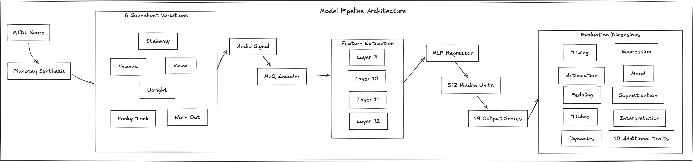

# CrescendAI

**A teacher for every pianist.**

Multi-platform (iOS + web) practice companion that evaluates *how* a piano performance sounds -- tone, dynamics, phrasing, pedaling -- not just note accuracy. iOS uses on-device Core ML inference; web captures audio in the browser and runs inference in the cloud. Both share a Cloudflare Workers backend for LLM feedback and data sync.

## Key Result

**R² = 0.537** on PercePiano benchmark (55% improvement over symbolic baselines)



| Model | R² | 95% CI | MAE |
|-------|-----|--------|-----|
| MuQ L9-12 (ours) | 0.537 | [0.465, 0.575] | 0.067 |
| Symbolic baseline | 0.347 | [0.315, 0.375] | 0.095 |

## Architecture

| Component | Details |
|-----------|---------|
| On-device inference | Core ML MuQ (~300M params), 6-dimension output |
| iOS app | SwiftUI, AVAudioEngine, SwiftData (local-first) |
| API backend | Rust Axum on Cloudflare Workers (`api.crescend.ai`) |
| Web app | TanStack Start practice companion (`crescend.ai`) -- chat, recording, real-time observations |
| Storage | D1 (SQLite), R2 (audio), KV (cache) |
| Auth | Sign in with Apple |

## Project Structure

```
apps/ios/          Native iOS app (SwiftUI, Core ML, AVAudioEngine)
apps/api/          Rust API Worker (Axum on Cloudflare Workers)
apps/web/          TanStack Start web practice companion (React, Tailwind CSS v4)
apps/inference/    HuggingFace inference endpoint (cloud fallback)
model/             PyTorch Lightning training pipeline
docs/              Architecture and implementation slices
```

## Documentation

See [docs/index.md](docs/index.md) for the full documentation hub -- architecture, implementation slices with status, model training docs, and getting-started guides.

## Setup

### Training Pipeline

```bash
cd model
uv sync
uv run python -m audio_experiments.training.runner
```

### API Worker

```bash
cd apps/api
npx wrangler dev
```

### Web App

```bash
cd apps/web
bun install
bun run dev
```

## Paper

For technical details, see the [paper on arXiv](https://arxiv.org/abs/2601.19029).
